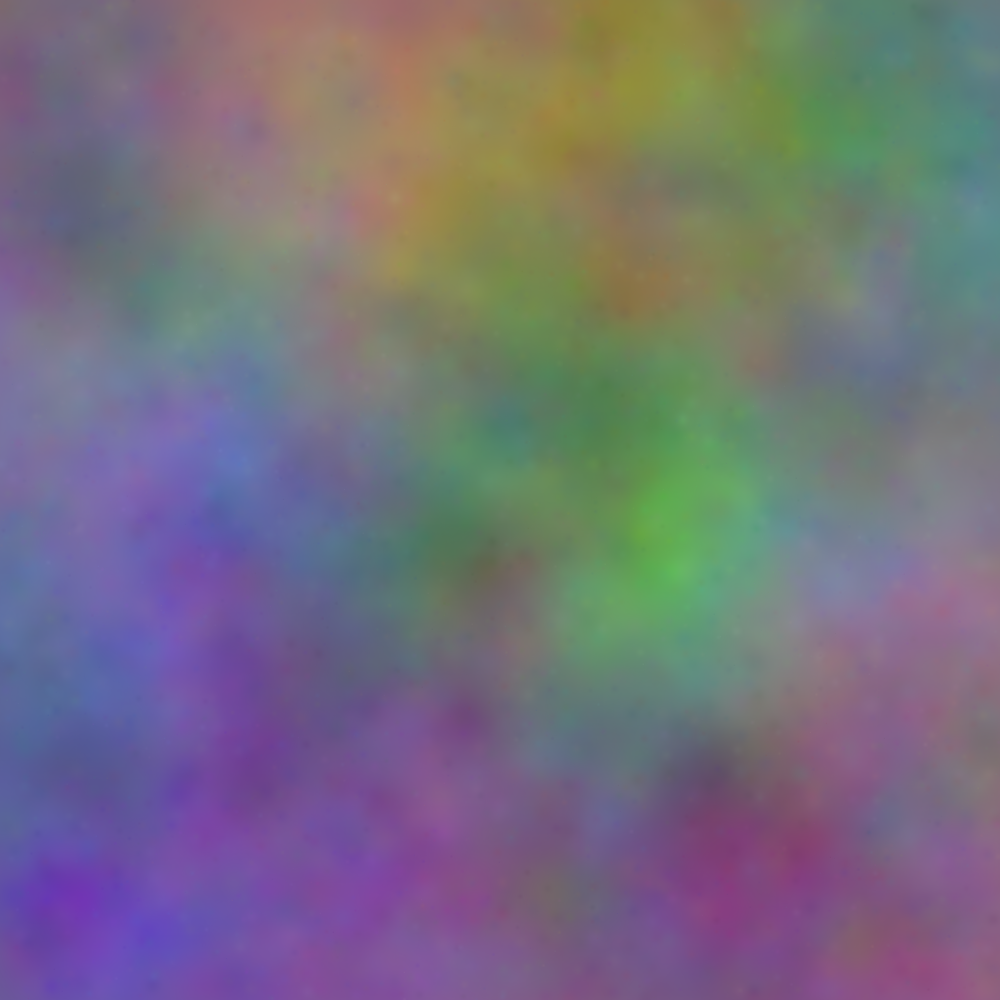
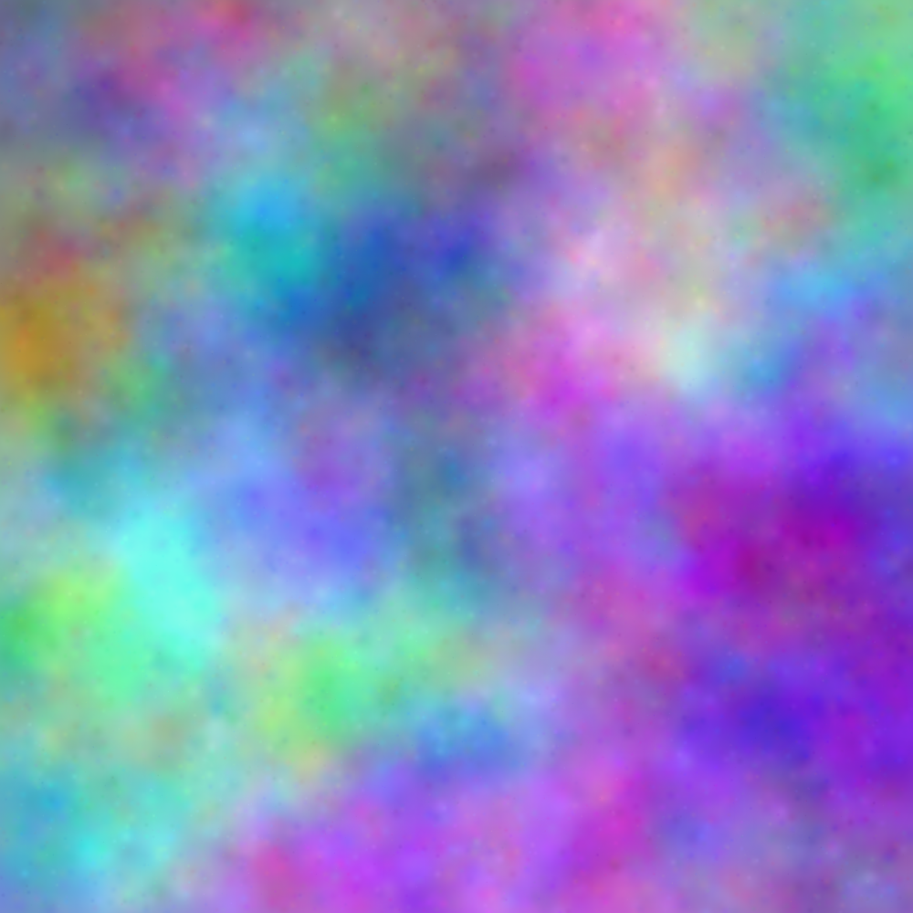

# Gaussian Peak Images

Log Normal sized gaussian blobs of color look lovely.

Call with:

$ peaks size num\_peaks radius\_center intensity name

Where:

size: The side length of the image, in pixels.
num\_peaks: The number of color blobs to add.
radius\_center: The center of the size distribution.
intensity: The maximum color intensity of a blob, on a RGB scale out of 256.
name: The filename to save to. Should be a PNG or JPEG, and the filetype will be chosen accordingly.

## Example
peaks 1000 8000 25 5 img4.png

peaks 1000 16000 12 10 img9.png

